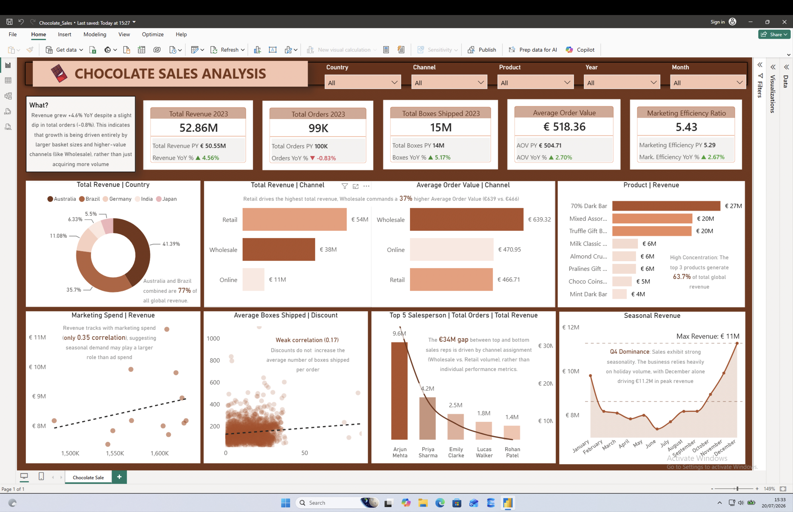
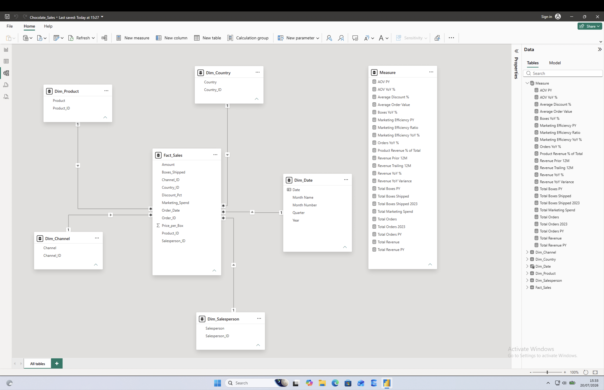
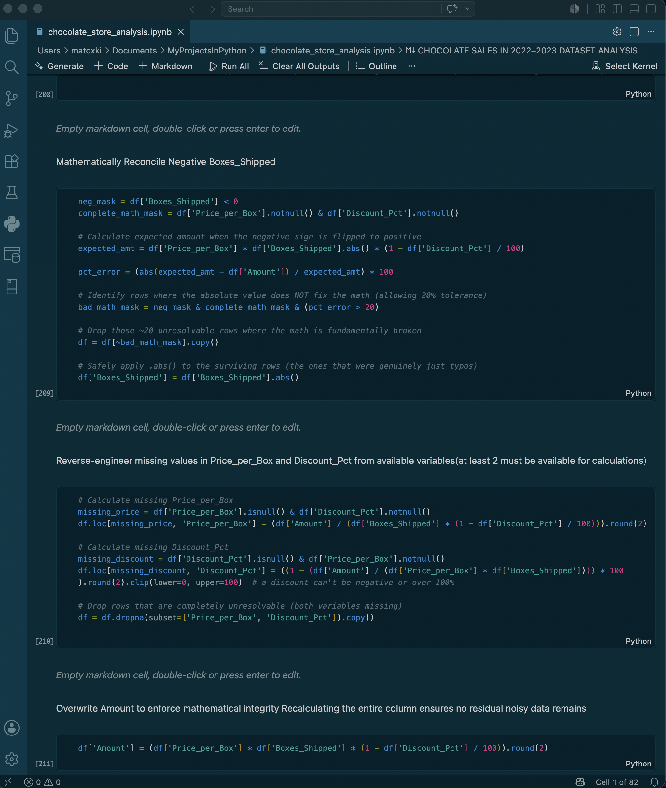

# Chocolate Sales Analytics: End-to-End BI Pipeline

Overview
An end-to-end business intelligence project transforming raw global sales data into an executive-level Power BI dashboard. The objective was to move beyond basic reporting to uncover actionable drivers of revenue, channel performance, and discount efficiency.

**The Tech Stack & Pipeline**

Data Manipulation (Python): Cleaned the raw data and performed EDA. Crucial fix: Audited and corrected a faulty data-filtering tolerance for Boxes_Shipped that was inadvertently dropping valid, high-density order records from the pipeline.

Semantic Modeling (Power BI): Designed a robust Star Schema (Fact and Dimension tables) to replace flat-file reporting.

Advanced DAX: Engineered custom time-intelligence measures using CALCULATE to isolate 2023 YoY performance variances natively within the KPIs.

UI/UX Design: Applied strategic "data-ink" ratios, transparent scatter plot density maps, and pre-attentive color highlighting to guide executive decision-making.

**Key Business Insights**

Channel Strategy: While Retail drives raw order volume, Wholesale is the true value driver, yielding a 37% higher Average Order Value (€639 vs. €466).
Discount Inefficiency: Statistical checks proved a weak correlation (0.17) between discount percentages and actual boxes shipped, indicating margin is being given away without driving additional volume.
Geographic Risk: 77% of all global revenue is concentrated in just two markets (Australia and Brazil).

